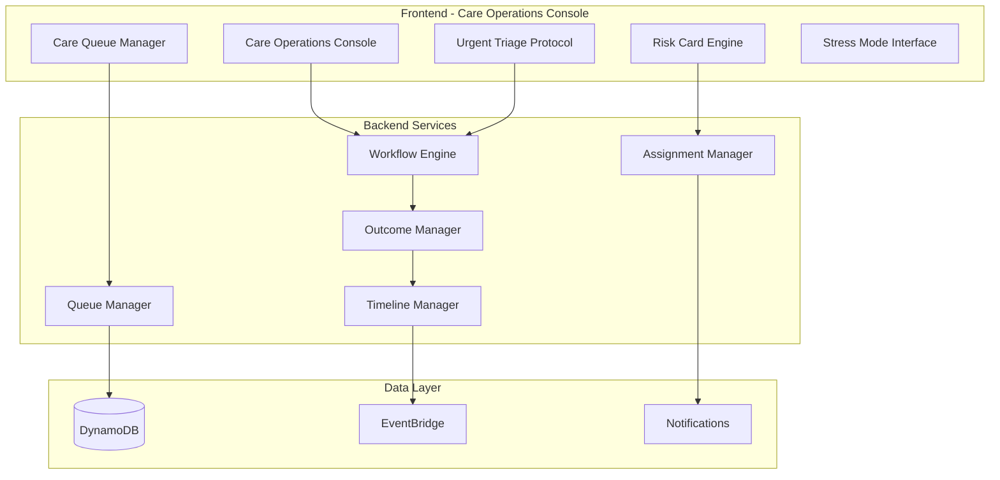
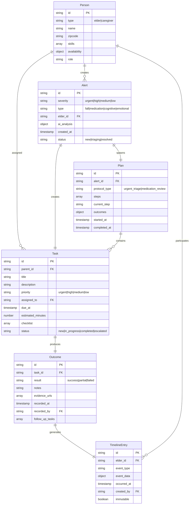
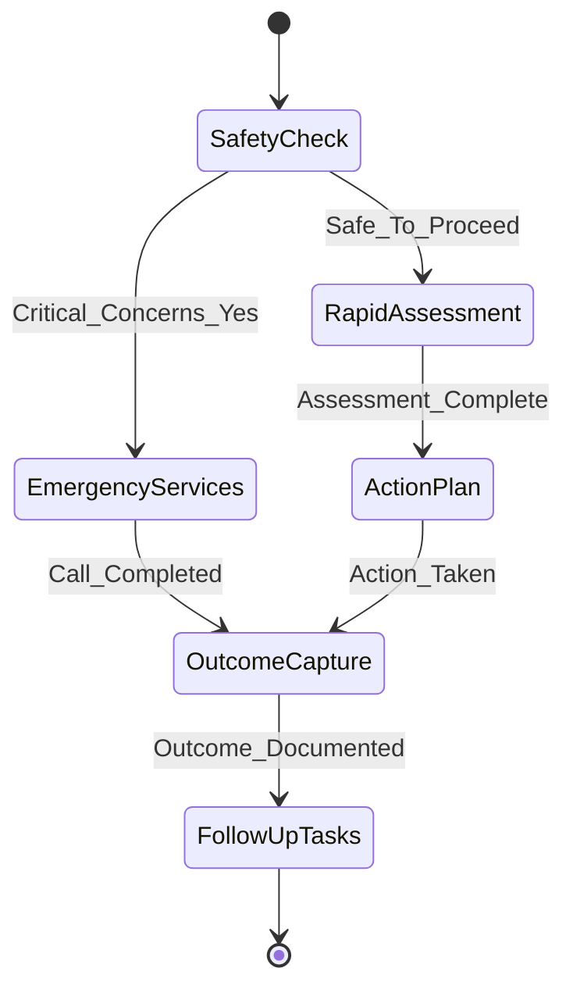

# Care Operations Console Design Document

## Overview

The Care Operations Console transforms CareCircle from an insight dashboard to a true operational system that enforces end-to-end caregiving workflows. This design addresses the critical gap identified in the solution architect review: caregivers need structured protocols to safely respond to urgent situations and complete care loops with documented outcomes.

The system implements a "Prevent Failure. Reduce Burden." philosophy through:
- **Structured Triage Protocols**: 4-step guided workflows for urgent situations
- **Unified Operational Queue**: Single prioritized view of all care responsibilities  
- **Closed-Loop Workflows**: Every alert/task requires outcome documentation
- **Role-Based Coordination**: Multi-user assignment with intelligent escalation
- **Stress-Aware Design**: Simplified interface for high-pressure situations

## Architecture

### High-Level System Architecture



### Domain Model



## Components and Interfaces

### 1. Care Operations Console (Main Dashboard)

**Purpose**: Primary interface that replaces the current dashboard with an operational console.

**Key Components**:
- **Urgent Banner**: Persistent banner for urgent items requiring immediate attention
- **Care Queue**: Unified view of all alerts, tasks, and scheduled activities
- **Risk Cards**: Actionable AI health assessments with standardized CTAs
- **Quick Actions**: Streamlined access to core functions
- **Family Status**: Real-time view of family member availability and assignments

**Interface Design**:
```typescript
interface CareOperationsConsole {
  urgentItems: UrgentItem[]
  careQueue: QueueItem[]
  riskCards: RiskCard[]
  familyStatus: FamilyMember[]
  stressModeEnabled: boolean
  
  // Methods
  enterStressMode(): void
  handleUrgentAlert(alertId: string): void
  assignTask(taskId: string, assigneeId: string): void
  escalateItem(itemId: string, escalateTo: string): void
}

interface UrgentItem {
  id: string
  type: 'fall' | 'injury' | 'medical_emergency' | 'medication_crisis'
  severity: 'urgent' | 'high'
  elderName: string
  timeElapsed: number // minutes since alert
  suggestedAction: string
  triageStatus: 'pending' | 'in_progress' | 'completed'
}
```

### 2. Urgent Triage Protocol Engine

**Purpose**: Guides caregivers through structured 4-step protocols for urgent situations.

**Workflow Steps**:
1. **Immediate Safety Check**: Critical yes/no questions about consciousness, breathing, bleeding
2. **Rapid Assessment**: Structured data collection (pain scale, mobility, medications)
3. **Action Plan Generation**: AI-driven recommendations with call scripts
4. **Outcome Capture**: Documentation of actions taken and results

**State Machine**:


**Interface Design**:
```typescript
interface TriageProtocol {
  alertId: string
  protocolType: 'fall' | 'injury' | 'chest_pain' | 'confusion'
  currentStep: TriageStep
  responses: Record<string, any>
  
  // Methods
  recordResponse(questionId: string, response: any): void
  proceedToNextStep(): TriageStep
  generateActionPlan(): ActionPlan
  captureOutcome(outcome: TriageOutcome): void
}

interface TriageStep {
  stepNumber: number
  title: string
  questions: TriageQuestion[]
  criticalFlags: string[]
  nextStepLogic: StepTransition[]
}

interface ActionPlan {
  recommendation: 'call_911' | 'urgent_care' | 'nurse_line' | 'monitor'
  callScript: string
  urgencyLevel: number
  estimatedTimeframe: string
  followUpTasks: TaskTemplate[]
}
```

### 3. Unified Care Queue Manager

**Purpose**: Merges alerts, tasks, medication events, and check-ins into a single operational queue.

**Queue Item Types**:
- **Alert**: AI-generated health concerns requiring triage
- **Task**: Assigned care activities with due dates
- **Medication Event**: Scheduled doses and adherence checks  
- **Check-in**: Scheduled wellness calls or visits
- **Follow-up**: System-generated tasks from completed workflows

**Prioritization Algorithm**:
```typescript
interface QueuePrioritization {
  calculatePriority(item: QueueItem): number
  
  // Priority factors (weighted):
  // 1. Severity (urgent=100, high=75, medium=50, low=25)
  // 2. Time sensitivity (overdue=+50, due today=+25)
  // 3. Elder risk level (high risk elder=+20)
  // 4. Assignment status (unassigned=+15)
  // 5. Previous escalations (+10 per escalation)
}

interface QueueItem {
  id: string
  type: 'alert' | 'task' | 'medication' | 'checkin' | 'followup'
  severity: 'urgent' | 'high' | 'medium' | 'low'
  title: string
  elderName: string
  assignedTo?: string
  dueAt: Date
  estimatedMinutes: number
  status: 'new' | 'in_progress' | 'completed' | 'snoozed' | 'escalated'
  suggestedAction: string
  priority: number // calculated score
}
```

### 4. Risk Card Engine

**Purpose**: Displays AI health assessments with standardized, actionable CTAs.

**Risk Card Types**:
- **Cognitive Risk**: Memory, orientation, decision-making trends
- **Medication Adherence**: Missed doses, confusion, side effects
- **Emotional Wellbeing**: Mood, social engagement, depression indicators
- **Physical Safety**: Fall risk, mobility, home hazards
- **Nutrition**: Eating patterns, weight changes, hydration

**Standardized CTA Patterns**:
```typescript
interface RiskCard {
  type: RiskType
  score: number // 0-100 normalized
  trend: TrendIndicator
  confidence: 'high' | 'medium' | 'low'
  dataCoverage: DataCoverage
  primaryCTA: ActionCTA
  factors: ContributingFactor[]
  safetyDisclaimer: string
}

interface ActionCTA {
  label: string // "Run 2-min Check-in Call"
  estimatedTime: number // minutes
  action: () => void
  urgency: 'immediate' | 'today' | 'this_week'
}

interface TrendIndicator {
  direction: 'improving' | 'stable' | 'declining'
  magnitude: number // percentage change
  timeframe: string // "since last week"
  significance: 'significant' | 'moderate' | 'minimal'
}
```

### 5. Assignment and Escalation Engine

**Purpose**: Intelligently assigns tasks and manages escalation workflows.

**Assignment Factors**:
- **Proximity**: ZIP code distance calculation
- **Skills**: Medical training, transportation access, language
- **Availability**: Calendar integration, on-call schedule, workload
- **Relationship**: Primary caregiver, medical POA, emergency contact
- **Historical Performance**: Response time, completion rate, quality

**Escalation Triggers**:
- Task overdue by defined threshold
- Multiple failed completion attempts  
- Assignee unavailable or non-responsive
- Complexity exceeds assignee skill level
- Elder condition deteriorates

```typescript
interface AssignmentEngine {
  calculateBestAssignee(task: Task, familyCircle: FamilyMember[]): AssignmentRecommendation
  escalateTask(taskId: string, reason: EscalationReason): EscalationPlan
  
  // Scoring algorithm:
  // proximity_score * 0.3 + skill_match * 0.25 + availability * 0.25 + 
  // relationship_priority * 0.15 + performance_history * 0.05
}

interface AssignmentRecommendation {
  recommendedAssignee: FamilyMember
  confidence: number
  reasoning: string[]
  alternativeOptions: FamilyMember[]
  estimatedResponseTime: number
}

interface EscalationPlan {
  escalateTo: FamilyMember[]
  escalationMessage: string
  timeoutThreshold: number
  nextLevelEscalation?: EscalationPlan
}
```

### 6. Outcome and Timeline Manager

**Purpose**: Captures outcomes and maintains immutable audit trails.

**Outcome Types**:
- **Task Completion**: Success/partial/failed with evidence
- **Triage Results**: Actions taken, emergency services called, follow-ups
- **Medication Events**: Doses taken, missed, side effects observed
- **Health Changes**: New symptoms, improvements, concerns

**Timeline Entry Structure**:
```typescript
interface TimelineEntry {
  id: string
  elderId: string
  timestamp: Date
  eventType: 'alert_created' | 'task_completed' | 'triage_performed' | 'medication_taken'
  participants: string[] // family member IDs
  eventData: {
    summary: string
    details: Record<string, any>
    outcomes: Outcome[]
    evidence: Evidence[]
  }
  immutable: true // cannot be edited after creation
  createdBy: string
  relatedItems: string[] // IDs of related alerts, tasks, etc.
}

interface Outcome {
  type: 'success' | 'partial' | 'failed' | 'escalated'
  description: string
  evidence: Evidence[]
  followUpRequired: boolean
  followUpTasks: TaskTemplate[]
  nextCheckIn?: Date
}
```

## Data Models

### DynamoDB Table Design (Single Table)

**Primary Key Structure**:
- **PK**: Entity type and ID (e.g., `ELDER#123`, `TASK#456`, `ALERT#789`)
- **SK**: Sort key for relationships (e.g., `TIMELINE#2024-01-15`, `ASSIGNMENT#USER123`)

**Global Secondary Indexes**:
- **GSI1**: Queue management (`GSI1PK=QUEUE#FAMILY123`, `GSI1SK=PRIORITY#TIMESTAMP`)
- **GSI2**: Assignment tracking (`GSI2PK=ASSIGNEE#USER123`, `GSI2SK=DUE_DATE`)
- **GSI3**: Timeline queries (`GSI3PK=ELDER#123`, `GSI3SK=TIMESTAMP`)

**Access Patterns**:
1. Get all queue items for family (sorted by priority)
2. Get tasks assigned to specific user
3. Get timeline for elder (chronological)
4. Get active alerts by severity
5. Get overdue tasks for escalation
6. Get family member workload distribution

### Event Schema for EventBridge

```json
{
  "source": "carecircle.operations",
  "detail-type": "Alert Created" | "Task Completed" | "Triage Started" | "Escalation Triggered",
  "detail": {
    "elderId": "string",
    "familyId": "string", 
    "severity": "urgent|high|medium|low",
    "assignedTo": "string",
    "metadata": {
      "alertType": "fall|medication|cognitive",
      "triageProtocol": "urgent_fall|medication_review",
      "outcome": "success|failed|escalated",
      "followUpTasks": ["taskId1", "taskId2"]
    }
  }
}
```

## Correctness Properties

*A property is a characteristic or behavior that should hold true across all valid executions of a system-essentially, a formal statement about what the system should do. Properties serve as the bridge between human-readable specifications and machine-verifiable correctness guarantees.*

<function_calls>
<invoke name="prework">
<parameter name="featureName">care-operations-console

### Property Reflection

After analyzing all acceptance criteria, I identified several areas where properties can be consolidated to eliminate redundancy:

**Consolidation Opportunities**:
- Properties 3.2, 3.3, 3.4 (Risk Card CTAs) can be combined into one comprehensive property about CTA standardization
- Properties 4.1, 4.3, 4.5 (Assignment UI elements) can be merged into assignment interface consistency
- Properties 5.1, 5.2, 6.5 (Outcome capture requirements) overlap and can be unified
- Properties 8.1, 8.2, 8.3 (Navigation consistency) can be combined into navigation standardization
- Properties 9.1, 9.2, 9.6 (Analytics tracking) can be merged into comprehensive analytics property

### Core Correctness Properties

**Property 1: Urgent Triage Protocol Consistency**
*For any* urgent alert (severity urgent/high), the system should always present the same 4-step triage protocol: Safety Check → Assessment → Action Plan → Outcome Capture, regardless of alert type or elder
**Validates: Requirements 1.1, 1.2, 1.4, 1.5, 1.6**

**Property 2: Emergency Safety Escalation**
*For any* safety concern identified during triage, the system should provide immediate access to emergency services with one-tap 911 dialing and appropriate call scripts
**Validates: Requirements 1.3, 7.3**

**Property 3: Care Queue Unified Display**
*For any* care-related item (alert, task, medication event, check-in), it should appear in the unified Care Queue with consistent display of severity, due time, owner, and suggested next step
**Validates: Requirements 2.1, 2.2, 2.5**

**Property 4: Queue State Machine Integrity**
*For any* queue item, state transitions should follow the valid path: New → In Progress → (Completed | Snoozed | Escalated), and invalid transitions should be rejected
**Validates: Requirements 2.4, 2.7**

**Property 5: Risk Card CTA Standardization**
*For any* risk card type (cognitive, medication, emotional), it should display a standardized primary CTA with estimated time, confidence level, and safety disclaimer
**Validates: Requirements 3.1, 3.2, 3.3, 3.4, 3.6, 3.7**

**Property 6: Assignment Intelligence**
*For any* task assignment, the system should consider proximity, skills, availability, and workload to recommend the most appropriate family member
**Validates: Requirements 4.2, 4.6**

**Property 7: Escalation Workflow Completeness**
*For any* escalation event, the system should notify the new assignee with full context, track the escalation in audit trails, and suggest further escalation if needed
**Validates: Requirements 4.3, 4.4, 4.7**

**Property 8: Outcome Capture Enforcement**
*For any* task or alert completion, the system should require outcome documentation (success/partial/failed + notes) before allowing the item to be marked complete
**Validates: Requirements 2.6, 5.1, 6.5**

**Property 9: Timeline Immutability**
*For any* care event, once a Timeline_Entry is created, it should be immutable and cannot be modified, ensuring audit trail integrity
**Validates: Requirements 1.7, 5.4, 10.6**

**Property 10: Follow-up Task Automation**
*For any* completed outcome indicating unresolved issues or specific results (e.g., failed medication check), the system should automatically create appropriate follow-up tasks with correct due dates
**Validates: Requirements 5.3, 6.6**

**Property 11: Stress Mode Interface Simplification**
*For any* UI element in Stress Mode, it should display larger text, bigger buttons, consistent labels, and reduced cognitive load while maintaining full functionality
**Validates: Requirements 7.1, 7.2, 7.4, 7.7**

**Property 12: Navigation Terminology Consistency**
*For any* UI element or navigation item, it should use standardized terminology ("Tasks" not "Care Actions", "Timeline" not "Care History") and eliminate duplication
**Validates: Requirements 8.1, 8.2, 8.3**

**Property 13: Analytics Comprehensive Tracking**
*For any* care operation (triage, task completion, assignment), the system should track both operational metrics (response times, completion rates) and health metrics (cognitive trends, medication adherence)
**Validates: Requirements 9.1, 9.2, 9.6, 9.7**

**Property 14: Domain Model Referential Integrity**
*For any* entity relationship (Task references Alert, Timeline_Entry references Task), the system should maintain referential integrity and prevent orphaned records
**Validates: Requirements 10.2, 10.3, 10.5**

**Property 15: Alert Processing Logic**
*For any* created alert, the system should spawn exactly one of: Plan (urgent/high severity), Task (medium/low severity), or Monitor rule, based on severity level
**Validates: Requirements 10.2**

## Error Handling

### Error Categories and Responses

**1. Critical Safety Errors**
- **Scenario**: 911 calling fails, emergency contact unreachable
- **Response**: Display multiple backup options, log critical error, escalate to all family members
- **Recovery**: Provide manual phone numbers, suggest alternative emergency services

**2. Triage Protocol Errors**
- **Scenario**: User exits triage mid-process, network failure during assessment
- **Response**: Save partial progress, allow resume from last completed step
- **Recovery**: Auto-save every response, offline mode for critical steps

**3. Assignment Engine Errors**
- **Scenario**: No family members available, skill matching fails
- **Response**: Assign to primary caregiver with notification, suggest external resources
- **Recovery**: Maintain fallback assignment hierarchy, escalate to care team

**4. Data Integrity Errors**
- **Scenario**: Timeline entry creation fails, outcome capture incomplete
- **Response**: Retry with exponential backoff, queue for later processing
- **Recovery**: Maintain local cache, sync when connectivity restored

**5. User Interface Errors**
- **Scenario**: Stress mode activation fails, navigation becomes unresponsive
- **Response**: Fallback to simplified interface, maintain emergency access
- **Recovery**: Reload core components, preserve user context

### Error Recovery Patterns

```typescript
interface ErrorRecovery {
  // Critical path preservation
  maintainEmergencyAccess(): void
  preserveTriageProgress(): void
  
  // Graceful degradation
  fallbackToOfflineMode(): void
  simplifyInterfaceOnError(): void
  
  // Data consistency
  queueFailedOperations(): void
  retryWithBackoff(): void
  
  // User communication
  displayClearErrorMessages(): void
  provideFallbackOptions(): void
}
```

## Testing Strategy

### Dual Testing Approach

The Care Operations Console requires both **unit tests** and **property-based tests** to ensure reliability in critical caregiving scenarios:

**Unit Tests Focus**:
- Specific triage protocol steps and decision trees
- Emergency calling functionality and fallbacks  
- Assignment algorithm edge cases (no available family members)
- Timeline entry creation and immutability
- Stress mode UI component behavior
- Error handling and recovery scenarios

**Property-Based Tests Focus**:
- Triage protocol consistency across all alert types
- Queue prioritization algorithm correctness
- Assignment engine fairness and optimization
- Outcome capture enforcement across all workflows
- Data integrity maintenance under concurrent operations
- Navigation consistency across all user paths

### Property Test Configuration

Each property test should run a minimum of 100 iterations to account for the complexity of caregiving scenarios. Tests should be tagged with:

**Feature: care-operations-console, Property {number}: {property_text}**

Example:
```javascript
// Property Test Example
test('Property 1: Urgent Triage Protocol Consistency', () => {
  fc.assert(fc.property(
    fc.record({
      alertType: fc.constantFrom('fall', 'injury', 'chest_pain', 'confusion'),
      severity: fc.constantFrom('urgent', 'high'),
      elderData: fc.record({
        name: fc.string(),
        age: fc.integer(65, 100),
        conditions: fc.array(fc.string())
      })
    }),
    (alertData) => {
      const protocol = startTriageProtocol(alertData);
      
      // Should always have 4 steps
      expect(protocol.steps).toHaveLength(4);
      expect(protocol.steps[0].title).toBe('Immediate Safety Check');
      expect(protocol.steps[1].title).toBe('Rapid Assessment');
      expect(protocol.steps[2].title).toBe('Action Plan Generation');
      expect(protocol.steps[3].title).toBe('Outcome Capture');
      
      // Should always include critical safety questions
      expect(protocol.steps[0].questions).toContainEqual(
        expect.objectContaining({
          text: 'Is the elder conscious and breathing normally?'
        })
      );
    }
  ), { numRuns: 100 });
});
```

### Integration Testing

**Critical User Journeys**:
1. **Urgent Fall Response**: Alert creation → Triage protocol → Emergency services → Outcome capture → Follow-up tasks
2. **Task Assignment Flow**: Task creation → Assignment algorithm → Family notification → Acceptance → Completion → Timeline entry
3. **Risk Card Action**: Risk assessment → CTA click → Guided workflow → Outcome documentation → Risk score update
4. **Escalation Workflow**: Overdue task → Escalation trigger → New assignment → Context transfer → Resolution
5. **Multi-User Coordination**: Simultaneous family member actions → Conflict resolution → Audit trail consistency

### Performance Requirements

**Response Time Targets**:
- Urgent alert display: < 500ms
- Triage protocol step transitions: < 200ms  
- Care queue loading: < 1s
- Assignment calculation: < 2s
- Timeline entry creation: < 300ms
- Emergency calling activation: < 100ms

**Scalability Targets**:
- Support 1000+ concurrent family members
- Handle 10,000+ queue items per family
- Process 100+ simultaneous triage protocols
- Maintain sub-second response under peak load

### Accessibility Testing

**WCAG 2.1 AA Compliance**:
- Keyboard navigation for all triage steps
- Screen reader compatibility for urgent alerts
- High contrast mode for stress situations
- Voice control integration for hands-free operation
- Mobile responsiveness for on-the-go caregiving

The testing strategy ensures the Care Operations Console maintains reliability and safety standards required for critical caregiving workflows while providing measurable confidence in system behavior across all scenarios.