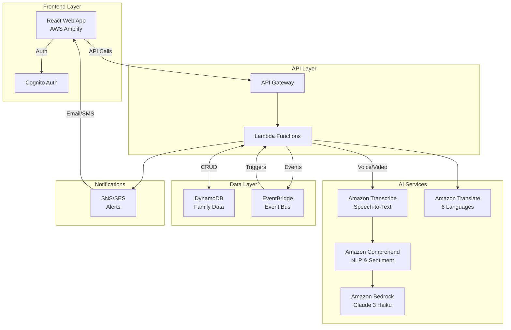
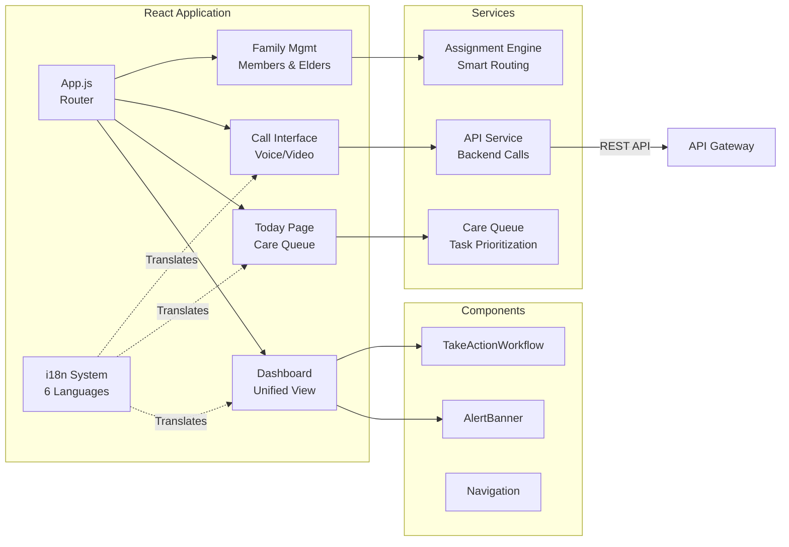
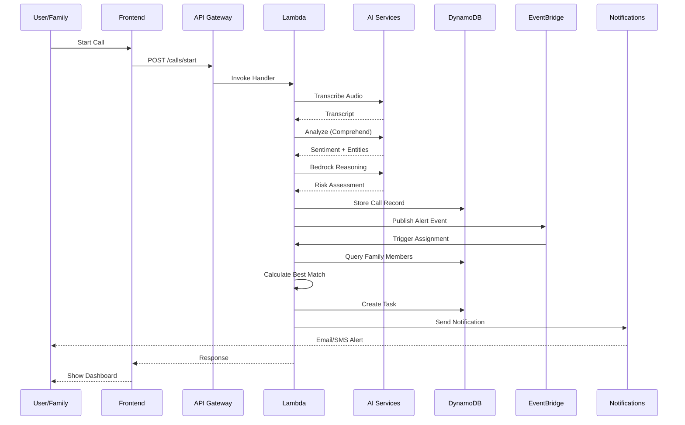

# CareCircle: AI-Powered Family Care Orchestration Platform

**🏆 AWS 10,000 AIdeas Hackathon Submission - December 2025**

[](FINAL_SUBMISSION.md)
[](https://aws.amazon.com)
[](TESTING_GUIDE.md)
[](USER_GUIDE.md)

## 📚 Documentation

**For Users (Family Caregivers)**:
- 📘 **[Complete User Guide](USER_GUIDE.md)** - 50+ page guide for all features
- 🗺️ **[Quick Navigation Card](QUICK_NAVIGATION_CARD.md)** - One-page reference

**For Developers & Architects**:
- 🏗️ **[Navigation Flows & Architecture](NAVIGATION_FLOWS.md)** - Technical flows & diagrams
- ✅ **[UI Consistency Report](UI_CONSISTENCY_COMPLETE.md)** - Design system documentation
- 🚀 **[Deployment Guide](DEPLOYMENT_CHECKLIST.md)** - Step-by-step deployment

**For Judges**:
- 🏆 **[Hackathon Submission](FINAL_SUBMISSION.md)** - Complete submission document
- 📊 **[Competition Ready Summary](COMPETITION_READY_SUMMARY.md)** - Feature overview

---

## Overview

CareCircle is an intelligent family care coordination platform that helps distributed families collaboratively care for their elderly loved ones. It uses AWS AI services to monitor conversations for signs of cognitive or behavioral changes and orchestrates caregiving tasks among family members based on proximity, language, skills, and availability.

## Architecture

### AWS Services Used (All Free Tier Eligible)

- **Frontend**: AWS Amplify Hosting, Amazon Cognito
- **Voice/Video**: Amazon Chime SDK, Amazon Connect (optional)
- **AI Services**: 
  - Amazon Transcribe (speech-to-text)
  - Amazon Comprehend (sentiment & NLP)
  - Amazon Translate (multilingual support)
  - Amazon Bedrock (LLM reasoning)
- **Backend**: AWS Lambda, Amazon API Gateway, Amazon EventBridge
- **Data**: Amazon DynamoDB
- **Notifications**: Amazon SNS, Amazon SES
- **Voice Interface**: Amazon Lex, Amazon Polly (optional)
- **Monitoring**: Amazon CloudWatch

### System Architecture



### Frontend Architecture



### Backend Data Flow



### Key Features

1. **Real-Time Behavioral Drift Detection**: AI analyzes voice/video calls for signs of memory lapses, confusion, or emotional distress
2. **Multi-Agent Task Assignment**: Automatically assigns tasks to the most appropriate family member based on ZIP code, language, skills, and availability
3. **Unified Coordination Dashboard**: Shared family dashboard for transparent task management
4. **Multilingual Support**: English, Spanish, Hindi, Arabic, Mandarin, Portuguese
5. **Real-Time & Asynchronous Coordination**: Instant alerts for urgent issues, scheduled tasks for routine care

## Project Structure

```
CareCircle/
├── frontend/                 # React + Amplify web application
│   ├── src/
│   │   ├── components/      # UI components
│   │   ├── pages/           # Page components
│   │   ├── services/        # API services
│   │   ├── locales/         # Translation files
│   │   └── utils/           # Utility functions
│   └── public/
├── backend/                  # AWS Lambda functions
│   ├── functions/
│   │   ├── transcribe-handler/
│   │   ├── ai-analysis/
│   │   ├── task-assignment/
│   │   ├── notification-handler/
│   │   └── api-handlers/
│   └── shared/              # Shared utilities
├── infrastructure/           # AWS CDK infrastructure code
│   └── lib/
└── docs/                    # Documentation

```

## Prerequisites

- Node.js 18+ and npm
- Python 3.11+
- AWS Account with appropriate permissions
- AWS CLI configured
- AWS CDK installed (`npm install -g aws-cdk`)
- AWS Amplify CLI installed (`npm install -g @aws-amplify/cli`)

## Quick Start

### 1. Clone and Install Dependencies

```bash
# Clone the repository
cd CareCircle

# Install all dependencies at once
npm run install:all

# Or install individually:
cd frontend && npm install
cd ../backend && pip install -r requirements.txt
cd ../infrastructure && npm install
```

### 2. Configure AWS Credentials

```bash
aws configure
# Enter your AWS Access Key ID, Secret Access Key, and default region (us-east-1 recommended)
```

### 3. Deploy Backend Infrastructure

```bash
cd infrastructure

# Bootstrap CDK (first time only)
cdk bootstrap

# Deploy the stack
cdk deploy

# Save the outputs (UserPoolId, UserPoolClientId, APIEndpoint)
```

### 4. Configure Frontend

Update `frontend/src/aws-exports.js` with the CDK outputs, or create a `.env` file:

```bash
cd frontend
cat > .env << EOF
REACT_APP_AWS_REGION=us-east-1
REACT_APP_USER_POOL_ID=your_user_pool_id_from_cdk_output
REACT_APP_USER_POOL_CLIENT_ID=your_client_id_from_cdk_output
REACT_APP_API_ENDPOINT=your_api_endpoint_from_cdk_output
EOF
```

### 5. Deploy Frontend with Amplify

```bash
cd frontend

# Initialize Amplify
amplify init
# Follow prompts: project name, environment, use AWS profile

# Add hosting
amplify add hosting
# Choose: Hosting with Amplify Console, Manual deployment

# Publish
amplify publish
```

### 6. Test Locally (Optional)

```bash
# Frontend
cd frontend
npm start
# Visit http://localhost:3000

# Backend (using SAM CLI)
cd backend
sam local start-api
```

### 7. Enable Bedrock Access

In AWS Console:
1. Go to Amazon Bedrock
2. Click "Model access"
3. Request access to "Claude 3 Haiku"
4. Wait for approval (usually instant)

### 8. Verify SES for Email Notifications

```bash
aws ses verify-email-identity --email-address noreply@yourdomain.com
# Check email and click verification link
```

## 📖 Documentation

For detailed instructions, see:
- **Deployment Guide**: `docs/DEPLOYMENT.md`
- **Architecture Details**: `docs/ARCHITECTURE.md`
- **Demo Script**: `docs/DEMO.md`
- **Hackathon Submission**: `HACKATHON_SUBMISSION.md`

## Development with AWS Kiro

This project was developed using AWS Kiro, the AI-powered IDE, to:
- Generate infrastructure-as-code (AWS CDK)
- Create boilerplate Lambda functions
- Optimize code for AWS Free Tier limits
- Implement best practices for serverless architecture

## Multilingual Support

CareCircle supports six languages:
- English (en)
- Spanish (es)
- Hindi (hi)
- Arabic (ar)
- Mandarin Chinese (zh)
- Portuguese (pt)

Translation files are located in `frontend/src/locales/`.

## Security & Privacy

- User authentication via Amazon Cognito
- Data encrypted at rest (DynamoDB encryption)
- Data encrypted in transit (SSL/TLS)
- IAM roles with least privilege principle
- CloudWatch logging for audit trails

## Cost Optimization

The platform is designed to operate within AWS Free Tier limits:
- Serverless architecture (pay only for usage)
- DynamoDB on-demand capacity
- Optimized Transcribe usage (short streams)
- Efficient Lambda execution (minimal compute time)
- CloudWatch metrics for cost monitoring

## Testing

```bash
# Frontend tests
cd frontend
npm test

# Backend tests
cd backend
python -m pytest
```

## Deployment

### Production Deployment

```bash
# Deploy infrastructure
cd infrastructure
cdk deploy --all --context env=production

# Deploy frontend
cd ../frontend
amplify publish
```

### CI/CD Pipeline

The project includes AWS CodePipeline configuration for automated deployments.

## Demo Scenario

See `docs/DEMO.md` for the 90-second demo walkthrough script.

## Impact Metrics

CareCircle tracks:
- Task completion rates
- Response times (alert to task acceptance)
- Issue resolution effectiveness
- Caregiver workload distribution
- Behavioral drift trends

## Monetization Strategy

1. **Freemium Model**: Basic coordination free, premium AI monitoring $20/month
2. **B2B2C Partnerships**: Employee benefit programs, insurance companies
3. **Healthcare Provider Licensing**: Integration with EHR systems

## Contributing

This is a hackathon project for AWS 10,000 AIdeas Hackathon. For questions or collaboration, please contact the team.

## License

Copyright 2025. All rights reserved.

## AWS Hackathon Compliance

- ✅ Uses AWS Free Tier eligible services
- ✅ Integrates Amazon Bedrock for generative AI
- ✅ Developed with AWS Kiro
- ✅ Original, unpublished code
- ✅ Aligns with Workplace Efficiency and Social Impact tracks

## Contact

For support or inquiries, please reach out through the hackathon portal.

