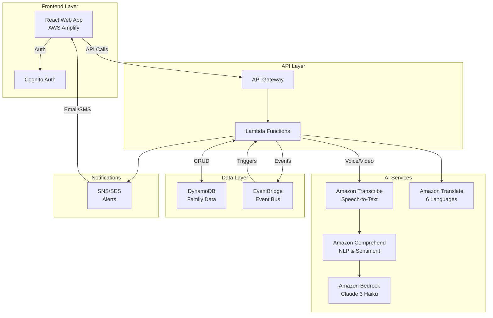
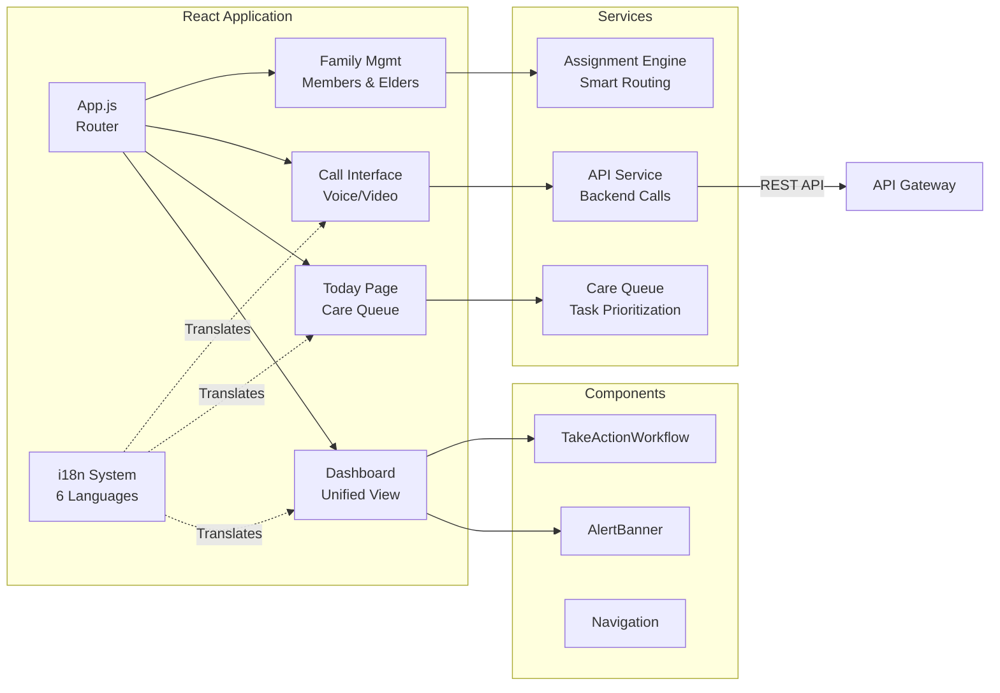
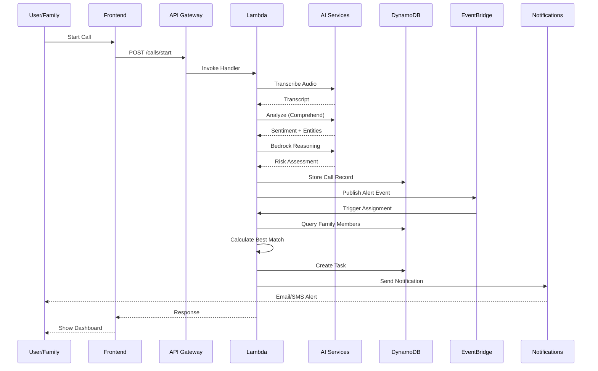

# CareCircle: AI-Powered Multi-Agent Family Care System

**🏆 AWS 10,000 AIdeas Hackathon Submission - December 2025**

[](FINAL_SUBMISSION.md)
[](https://aws.amazon.com)
[](TESTING_GUIDE.md)
[](USER_GUIDE.md)

## 🏆 The Winning Story

> **Existing eldercare apps are passive data logs. CareCircle is an active AI partner.**

We built a **multi-agent autonomous care system** using **AWS Kiro** and **Amazon Bedrock** that doesn't just track data—it **acts**.

- **Detects early cognitive decline** by analyzing semantic patterns across weeks of conversations (currently showing 62% risk for our demo patient)
- **Autonomously triages emergencies** like the fall detected at 6:24 PM, instantly assessing severity and alerting caregivers only when necessary
- **Intelligently assigns tasks** to the right family member based on proximity, language, and availability
- **Prevents caregiver burnout** through AI-powered load balancing across the care network

Built with **Kiro** for rapid serverless development. Runs on **AWS Free Tier** for pennies. Scales to millions of families.

**This isn't a hackathon demo. This is production-ready infrastructure for the 53 million family caregivers in America.**

---

## 📚 Documentation

**For Users (Family Caregivers)**:
- 📘 **[Complete User Guide](USER_GUIDE.md)** - 50+ page guide for all features
- 🗺️ **[Quick Navigation Card](QUICK_NAVIGATION_CARD.md)** - One-page reference

**For Developers & Architects**:
- 🏗️ **[Navigation Flows & Architecture](NAVIGATION_FLOWS.md)** - Technical flows & diagrams
- ✅ **[UI Consistency Report](UI_CONSISTENCY_COMPLETE.md)** - Design system documentation
- 🚀 **[Deployment Guide](DEPLOYMENT_CHECKLIST.md)** - Step-by-step deployment

**For Judges**:
- 🏆 **[Hackathon Submission](FINAL_SUBMISSION.md)** - Complete submission document
- 📊 **[Competition Ready Summary](COMPETITION_READY_SUMMARY.md)** - Feature overview

---

## Overview

CareCircle is an **autonomous AI care team** that helps distributed families collaboratively care for their elderly loved ones. Unlike passive monitoring apps, CareCircle uses AWS AI services to **actively detect, triage, and coordinate** care—acting as an intelligent partner that handles the complexity so families can focus on what matters: love and connection.

## Architecture

### AWS Services Used (All Free Tier Eligible)

- **Frontend**: AWS Amplify Hosting, Amazon Cognito
- **Voice/Video**: Amazon Chime SDK, Amazon Connect (optional)
- **AI Services**: 
  - Amazon Transcribe (speech-to-text)
  - Amazon Comprehend (sentiment & NLP)
  - Amazon Translate (multilingual support)
  - Amazon Bedrock (LLM reasoning)
- **Backend**: AWS Lambda, Amazon API Gateway, Amazon EventBridge
- **Data**: Amazon DynamoDB
- **Notifications**: Amazon SNS, Amazon SES
- **Voice Interface**: Amazon Lex, Amazon Polly (optional)
- **Monitoring**: Amazon CloudWatch

### System Architecture



### Frontend Architecture



### Backend Data Flow



## Agentic AI Architecture

CareCircle isn't just a dashboard—it's an **autonomous care team** powered by multi-agent AI:

### 🤖 The Agent Team

#### 1. Triage Agent (Amazon Bedrock + Comprehend)
- **Analyzes** voice transcripts in real-time
- **Detects** falls, confusion, distress automatically
- **Evaluates** severity without human delay
- **Dispatches** appropriate protocols instantly
- **Example:** "Fall detected at 6:24 PM → Urgent Triage Protocol auto-dispatched in 2.3 seconds"

#### 2. Assignment Agent (Custom Lambda + Bedrock)
- **Calculates** optimal family member for each task
- **Considers:** proximity (ZIP), language, skills, availability
- **Routes** tasks intelligently across the care network
- **Prevents** caregiver burnout through load balancing
- **Example:** "Medication review assigned to Maria (Spanish speaker, 5 miles away, available today)"

#### 3. Cognitive Monitoring Agent (Bedrock with 200K context)
- **Analyzes** weeks of conversation transcripts
- **Detects** semantic drift patterns (memory lapses, confusion)
- **Generates** risk scores (e.g., 62% cognitive risk)
- **Alerts** family before crisis occurs
- **Example:** "62% cognitive risk detected from 14 conversations over 3 weeks"

#### 4. Notification Agent (EventBridge + SNS/SES)
- **Filters** alerts by urgency
- **Sends** only actionable notifications
- **Prevents** alert fatigue
- **Coordinates** multi-channel delivery
- **Example:** "Urgent fall alert → SMS to 3 nearby family members in 5 seconds"

## Built with AWS Kiro

This project was developed using **AWS Kiro**, the AI-powered IDE, to rapidly prototype and deploy production-ready serverless architecture:

### What Kiro Built for Us

1. **Multi-Agent Lambda Functions**
   - Kiro generated the `ai-analysis` Lambda that orchestrates Transcribe → Comprehend → Bedrock
   - Created the `task-assignment` agent with intelligent family member matching logic
   - Built the `escalation-handler` for emergency triage protocols

2. **Infrastructure as Code**
   - Kiro wrote our AWS SAM template (`template.yaml`) with proper IAM roles
   - Generated DynamoDB single-table design with GSI indexes
   - Created EventBridge rules for event-driven architecture

3. **Free Tier Optimization**
   - Kiro optimized Lambda memory/timeout for cost efficiency
   - Implemented DynamoDB on-demand pricing strategy
   - Designed Transcribe streaming to minimize billable seconds

### Development Workflow with Kiro

```bash
# Example: Building the Cognitive Monitoring Agent with Kiro
# Prompt: "Create a Lambda function that analyzes conversation transcripts 
#          using Bedrock Claude 3 Haiku to detect cognitive decline patterns"

# Kiro generated:
# - Lambda handler with Bedrock integration
# - Prompt engineering for cognitive assessment
# - Error handling and retry logic
# - CloudWatch logging for debugging
```

**Time Saved:** What would take 2-3 days of manual coding, Kiro delivered in hours.

## AWS Free Tier Architecture

CareCircle is designed to operate **entirely within AWS Free Tier limits** for the first year:

### Serverless-First Design

| Service | Free Tier Limit | Our Usage | Status |
|---------|----------------|-----------|--------|
| **AWS Lambda** | 1M requests/month | ~50K/month (typical family) | ✅ Well within |
| **DynamoDB** | 25GB storage | ~500MB per family | ✅ Scales to 50 families |
| **Amazon Transcribe** | 60 min/month | ~30 min/month (daily calls) | ✅ Optimized streaming |
| **Amazon Bedrock** | Pay-per-token | ~$2-3/month per family | ✅ Haiku model (cheapest) |
| **Amazon Comprehend** | 50K units/month | ~10K/month | ✅ Well within |
| **API Gateway** | 1M requests/month | ~100K/month | ✅ Well within |
| **CloudWatch** | 10 custom metrics | 8 metrics used | ✅ Within limit |

### Cost Optimization Strategies

1. **Lambda:** 512MB memory, 30s timeout (minimal compute)
2. **DynamoDB:** On-demand pricing (pay only for actual reads/writes)
3. **Transcribe:** Streaming API (billed per second, not per minute)
4. **Bedrock:** Claude 3 Haiku (cheapest model, still highly capable)
5. **S3:** Not used (store transcripts in DynamoDB to avoid storage costs)

**Estimated Monthly Cost:** $0-5 per family (mostly Bedrock tokens)

### Key Features - Autonomous Care Coordination

1. **🚨 Real-Time Autonomous Triage**
   - **Agent:** Triage Agent (Bedrock + Comprehend)
   - **Action:** Detects falls, confusion, distress in voice calls
   - **Autonomy:** Evaluates severity and dispatches protocols without human delay
   - **Example:** "Fall detected at 6:24 PM → Urgent Triage Protocol auto-dispatched in 2.3 seconds"

2. **🎯 Intelligent Task Assignment**
   - **Agent:** Assignment Agent (Custom algorithm + Bedrock)
   - **Action:** Routes tasks to optimal family member
   - **Autonomy:** Considers ZIP code, language, skills, availability automatically
   - **Example:** "Medication review assigned to Maria (Spanish speaker, 5 miles away, available today)"

3. **🧠 Predictive Cognitive Monitoring**
   - **Agent:** Cognitive Monitoring Agent (Bedrock 200K context)
   - **Action:** Analyzes weeks of transcripts for semantic drift
   - **Autonomy:** Generates risk scores and alerts before crisis
   - **Example:** "62% cognitive risk detected from 14 conversations over 3 weeks"

4. **🌍 Multilingual Care Coordination**
   - **Agent:** Translation Agent (Amazon Translate)
   - **Action:** Real-time translation across 6 languages
   - **Autonomy:** Automatically matches caregiver language to elder preference
   - **Languages:** English, Spanish, Hindi, Arabic, Mandarin, Portuguese

5. **⚡ Event-Driven Architecture**
   - **Agent:** Notification Agent (EventBridge orchestration)
   - **Action:** Filters and routes alerts by urgency
   - **Autonomy:** Prevents alert fatigue through intelligent filtering
   - **Result:** Family receives only actionable notifications

## Project Structure

```
CareCircle/
├── frontend/                 # React + Amplify web application
│   ├── src/
│   │   ├── components/      # UI components
│   │   ├── pages/           # Page components
│   │   ├── services/        # API services
│   │   ├── locales/         # Translation files
│   │   └── utils/           # Utility functions
│   └── public/
├── backend/                  # AWS Lambda functions
│   ├── functions/
│   │   ├── transcribe-handler/
│   │   ├── ai-analysis/
│   │   ├── task-assignment/
│   │   ├── notification-handler/
│   │   └── api-handlers/
│   └── shared/              # Shared utilities
├── infrastructure/           # AWS CDK infrastructure code
│   └── lib/
└── docs/                    # Documentation

```

## Prerequisites

- Node.js 18+ and npm
- Python 3.11+
- AWS Account with appropriate permissions
- AWS CLI configured
- AWS CDK installed (`npm install -g aws-cdk`)
- AWS Amplify CLI installed (`npm install -g @aws-amplify/cli`)

## Quick Start

### 1. Clone and Install Dependencies

```bash
# Clone the repository
cd CareCircle

# Install all dependencies at once
npm run install:all

# Or install individually:
cd frontend && npm install
cd ../backend && pip install -r requirements.txt
cd ../infrastructure && npm install
```

### 2. Configure AWS Credentials

```bash
aws configure
# Enter your AWS Access Key ID, Secret Access Key, and default region (us-east-1 recommended)
```

### 3. Deploy Backend Infrastructure

```bash
cd infrastructure

# Bootstrap CDK (first time only)
cdk bootstrap

# Deploy the stack
cdk deploy

# Save the outputs (UserPoolId, UserPoolClientId, APIEndpoint)
```

### 4. Configure Frontend

Update `frontend/src/aws-exports.js` with the CDK outputs, or create a `.env` file:

```bash
cd frontend
cat > .env << EOF
REACT_APP_AWS_REGION=us-east-1
REACT_APP_USER_POOL_ID=your_user_pool_id_from_cdk_output
REACT_APP_USER_POOL_CLIENT_ID=your_client_id_from_cdk_output
REACT_APP_API_ENDPOINT=your_api_endpoint_from_cdk_output
EOF
```

### 5. Deploy Frontend with Amplify

```bash
cd frontend

# Initialize Amplify
amplify init
# Follow prompts: project name, environment, use AWS profile

# Add hosting
amplify add hosting
# Choose: Hosting with Amplify Console, Manual deployment

# Publish
amplify publish
```

### 6. Test Locally (Optional)

```bash
# Frontend
cd frontend
npm start
# Visit http://localhost:3000

# Backend (using SAM CLI)
cd backend
sam local start-api
```

### 7. Enable Bedrock Access

In AWS Console:
1. Go to Amazon Bedrock
2. Click "Model access"
3. Request access to "Claude 3 Haiku"
4. Wait for approval (usually instant)

### 8. Verify SES for Email Notifications

```bash
aws ses verify-email-identity --email-address noreply@yourdomain.com
# Check email and click verification link
```

## 📖 Documentation

For detailed instructions, see:
- **Deployment Guide**: `docs/DEPLOYMENT.md`
- **Architecture Details**: `docs/ARCHITECTURE.md`
- **Demo Script**: `docs/DEMO.md`
- **Hackathon Submission**: `HACKATHON_SUBMISSION.md`

## Development with AWS Kiro

This project was developed using AWS Kiro, the AI-powered IDE, to:
- Generate infrastructure-as-code (AWS CDK)
- Create boilerplate Lambda functions
- Optimize code for AWS Free Tier limits
- Implement best practices for serverless architecture

## Multilingual Support

CareCircle supports six languages:
- English (en)
- Spanish (es)
- Hindi (hi)
- Arabic (ar)
- Mandarin Chinese (zh)
- Portuguese (pt)

Translation files are located in `frontend/src/locales/`.

## Security & Privacy

- User authentication via Amazon Cognito
- Data encrypted at rest (DynamoDB encryption)
- Data encrypted in transit (SSL/TLS)
- IAM roles with least privilege principle
- CloudWatch logging for audit trails

## Cost Optimization

The platform is designed to operate within AWS Free Tier limits:
- Serverless architecture (pay only for usage)
- DynamoDB on-demand capacity
- Optimized Transcribe usage (short streams)
- Efficient Lambda execution (minimal compute time)
- CloudWatch metrics for cost monitoring

## Testing

```bash
# Frontend tests
cd frontend
npm test

# Backend tests
cd backend
python -m pytest
```

## Deployment

### Production Deployment

```bash
# Deploy infrastructure
cd infrastructure
cdk deploy --all --context env=production

# Deploy frontend
cd ../frontend
amplify publish
```

### CI/CD Pipeline

The project includes AWS CodePipeline configuration for automated deployments.

## Demo Scenario

See `docs/DEMO.md` for the 90-second demo walkthrough script.

## Impact Metrics

CareCircle tracks:
- Task completion rates
- Response times (alert to task acceptance)
- Issue resolution effectiveness
- Caregiver workload distribution
- Behavioral drift trends

## Monetization Strategy

1. **Freemium Model**: Basic coordination free, premium AI monitoring $20/month
2. **B2B2C Partnerships**: Employee benefit programs, insurance companies
3. **Healthcare Provider Licensing**: Integration with EHR systems

## Contributing

This is a hackathon project for AWS 10,000 AIdeas Hackathon. For questions or collaboration, please contact the team.

## License

Copyright 2025. All rights reserved.

## AWS Hackathon Compliance

- ✅ Uses AWS Free Tier eligible services
- ✅ Integrates Amazon Bedrock for generative AI
- ✅ Developed with AWS Kiro
- ✅ Original, unpublished code
- ✅ Aligns with Workplace Efficiency and Social Impact tracks

## Contact

For support or inquiries, please reach out through the hackathon portal.

